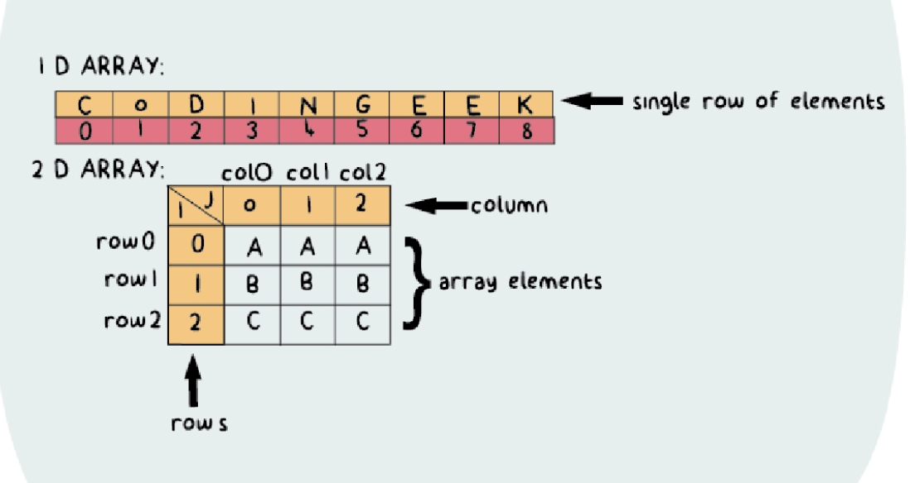

# Java Arrays:
***   
There are situations where we need to store the similar or correlated data sucha as marks of a student in five subjects. This can be achieved by jest declaring five different variables. But this has drawbacks:
* more memory will be required since the new block of memory space will be allocated 
    to every variable
* Processing and accessing this data would become touch since we would need to refer 
    them using their different variable names
* each element (variable) here would be independant. Therefore, it would be tough to 
    correlate those variables with a particular student
#### Arrays are the answer to these drawbacks
### Array:
* is a data structure that allows us to store multiple values in a single variable.
    in simple words we can group various data together into groups
* an array is a fixed-size sequential colection of elements. These element have to be 
    of a similar type. Meaning an array can only store one data type but many of values in that form
##### SYNTAX !!!!!
data_type[] array_name;
array_name = new data_type[size];
|| OR ||
* you can combine those steps into one
data_type[] array_name = new data_type[size];
ex: int[] marks = new int[5];

### For Each Loop (Java5 addition)(AKA Enhanced For Loop)
- is a loop secifically for iterating of arrays in Java
##### SYNTAX ##### 
for(data_type loop_variable : collection){
    //body of loop
}

#### Reason to NOT use a for each loop: (err will occur during:)
* for each loops are no bueno when you want to modify the array
* the for each loop does not keep track of the index, so we cannot obtain array index 
    using the for each loop 
* for each loop only iterates forward over the array in single steps. Since we do not 
    have the counter variable, we cannot change the traversing flow

### Multidimesional Arrays(mda) || AKA N-dimensional ||
- n-dimensional arrays in Java are also known as arrays of arrays since each element 
    of a multi-dimensiaonal array(mda) is another array
- in mdas the representation of elements is in rows and columns, there can be 
    different types of mdas in which 2D and 3D mdas are generally used
    (2D = square, rectangle, etc || 3D = cube, polygon, etc)
- the simplest representation of a mda is a 2D mda. (2 arrays inside one array)
- in Java a 2D array can be visualized as a mathematical matrix or a table which is 
    stored in the form of rows and columns.
##### SYNTAX #####    
data_type[][]array_name = new data_type[rows][columns];   

- as we know a 2D array can be visualized in a tabular form. Therefore, a 2D array
    can be seen as a table with 'i' rows and 'j' columns where the row number ranges
    from 0 to (i-1) and column number ranges from 0 to (j-1)
- EX assume we have a 2D array with 3 rows and 3 columns, that is 3x3 array, then 
    below is how each cell of the array can be represented
##### Row Col1 Col2 Col3 [i,j]
row 1 - [0,0] - [0,1] - [0,2]
row 2 - [1,0] - [1,1] - [1,2]
row 3 - [2,0] - [2,1] - [2,2]
- also the total num of elements that can be stored in a mda can be caluculated by multipltying the size of all the dimensions. So in the above example the array would have 9 (3x3) elements
- REMEMBER if your going to loop through a 2D array you will need 2 loops
    * The 1st will iterate over the rows
    * 2nd will iterate over the columns