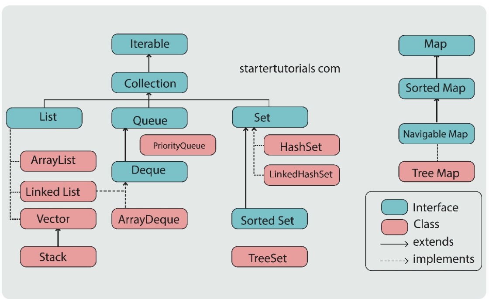

# Collections Framework:
***   
### Data in Programming:
- So far along the Java journey, all the structrures that we have used such as variables or arrays stroed in primitive data types. But, there are situations where we need to store objects and manipulate them..... Java Collections eenters the room.
    * They haelp us to work with data efficiently nd prvde some amazing methods that do the job of manipulation easily.
***   
### Collections in Java:
- Data storage and mainpulation are the pillars of any powerful software app.
- In Java, all the data types allow us to store a single value in the computer memory.
    Whenever we define a variable, a single block of memory space is allocated to thay variable which is refferred to using the variable name.
- There are situations where we need to stroe similar or correlated data such as marks of a student in five subjects. We know we use an array for this.
##### Array Drawbacks:
- An array in Java is a data strcture that allows us to store multiple values in a single variable. In simple words, using and array, we can group various daya items into a single container. Bute heres the downside:
    * arrays have fixed size so the array is structurally not dynamic
##### Collections:
- any group of individual objects which are represented as a single unit is knwona as the collection of the objects. Collections in Java are used to store the group of objects or data and provide access to these for efficient manipulation.
- In simple terms, collections can be defined as a group of related data items with an assiciated name. The data items in the collection can be of any object type but must be stored in a common schema (data structure)
- Technically, a colection is an object or container which stores a group of other objects as a single unit or single entity. Here the container (collection or data structure) can be different in different instances and the way of accessing the objects might differ as well.
- An element in a collection is known as a collection object or container object. A container object mean t contains other objects. In simple words, a collection is a container that stores multiple elements together
- JVM stores the reference of other objects into a collection object
- It never stores physical copies of other objects because othe objects are already available in the memory and storing another copy would be a waste of memory.
- To work with collections in Java, a separate framework named the Collection Framework has been defined which holds all the collection classes and interfaces in it.
- A framework is a set of classes and interfaces which provide a ready-made architecture. In order to implement a new feature or a class, there is no need to define a framework.
- However, an optimal object-oriented deisgn always includes a framwork with a colection of classes such that all the classes perform the same kind of task.
- A java collections framework is a sophisticated heirarchy of several perdefined interfaces and implementation classes that can be used to handle a group of objects as a single entity. It is present in the java.util package
***    
### Understand Containers:
- The first type of container stores only individual objects in a collection together as a single entity. This is referd to as a Java Collection.
- Along with these, Java also provides structures that enable us to store data in the form of key-value pairs. This type of containetr is called a Map in Java.

- With the above interfaces and classes of the colleciton framework alsop called the collection frame work heirarchy.
- All the interfaces and classes for the collection framework are located in the java.util package.
- The collection framework contians an interface named an Iterable interface which provides the iterator to iterate through all the collections. this interface is extended by the main Collection interface which acts as root for the collections framework.
- All the collections extend this collection interface thereby extending the properties of the iterator and the methods of this interface.
- Further, the Collection interaface is extended by the List, Queue, and the Set interfaces. 
- As we know along with Collection interaface, there is another root interface called Map. This Map interface does not extend the Collection interface because it stores key-value pairs, and the classes that come under the Collection interface only store values.
### Collection Interface:
* The Collection interface is the foundation upon which the collection framework is built. It is places that the toip of the heirarchy.
* It provides the basic operations for adding and removing elements in the collecitons by delcaring the core methods that all collections will have.
* The COlleciton interface extends the Iterable interface. The iterable interface has only one method called iterator(). Thefunction of the iteraotr methods is to return the iteraitor object using which we can iterate over the elements of the collection
#### Collection Interface Methods:
- The collection interface defines several methods that help in manipulatin ght elemenets of a colleciton which the implementation classes invoke. Following are some of them:
    * boolean add(Object obj): is used to add or insert an element in the collection. It returns a boolean value true if the obj was added to the collection or returns false if the obj is already a member of the collection, or if the collection does not allow duplicates.
    * boolean remove(Object obj): removes a specified element from the collection. It returns true if the element was removed, Otherwise false
    * int size(): returns the total number of elements in the colleciton as an integer.
    * boolean contains(Object obj): checks if an element is present pr not in a collection and accordingly returns a boolean value 
    * void clear(): clears or removes all the elements from the colleciton. 
    * boolean isEmpty(): is used to check if the collection is empty and returns a boolean value accordingly.
    Object[] toArray(): returns a new array from containing all the elements from the collection. In simple words the elements of the collection are coopied to an array.