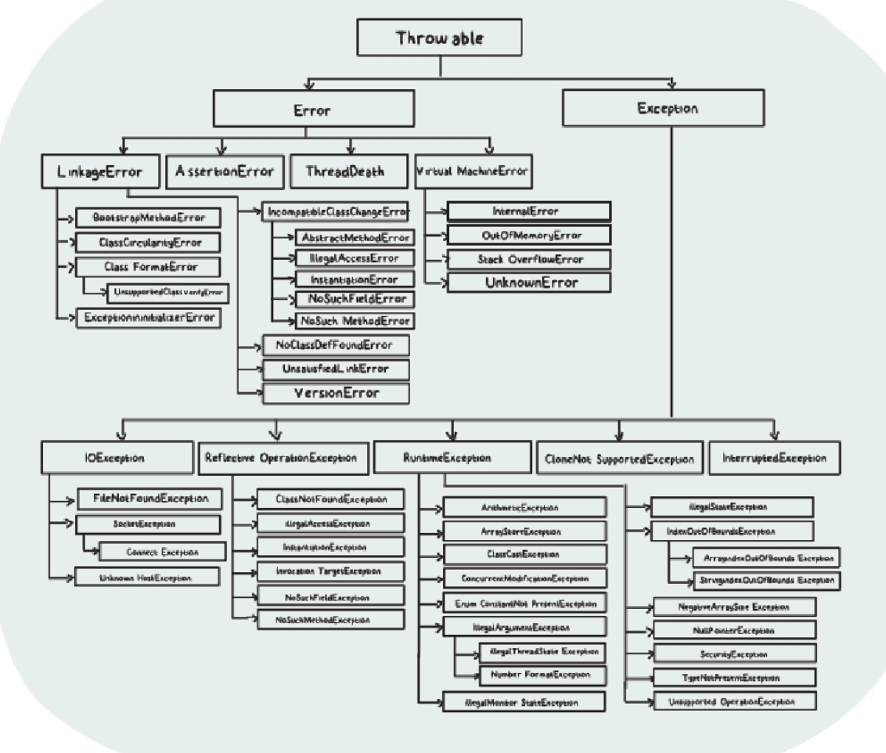

# Exceptions:
- any error the user can see is basically a bad user experience, and might even stop the application.
- Errors are the mistakes or faults in the program that cause it to behave unexpectedly
- Programming errors are generally known as bugs and the process to remove bugs from the program is called debugging.
- In general, there are three tyoes in which errors are categorized:
    * Syntax errors - is an error in the 
        source code of a program 
    * Logic errors - logic errors will cause your program to perform in undesired operations that you didn't intend your program to perform. = IMPROPER LOGIC 
    * Runtime errors - errors not in syntax or logic so not caught by complier but when u look at the program u notice a bug. they are generated when the program is running and lead to abnormal behavior or termination of the program. The general cause of runtime errors is because your program is trying tp perform an oipoeration that is not possible to carry out.
***   
### Excpetion Handling:
- Runtime errors are called Exceptions.
- In simple words, an exception is an error that happens at the time of execution of a program. Therefore, it is an unwanted event that interrupts the normal flow of the program because when such an exception occurs, program execution is terminated
##### Handling Exceptions:
- If an exception occurs, which has not been handled by the programmer then program execution gets terminated and a system generated error message is shown to the user. This message is not user friendly so they wont understand it. To make these messages understandable we use exceptions.
- We handle such conditions and print a user friendly warning message to the users, which lets them correct the error. Thus, it is a good idea to handle and manage these exceptions with grace rather than throwing errors to the users rezulting in termination of the program.
- The biggest benifit of exception handling in Java is to maintain a programs flow.
- If the exception is handled, then the complier will skip only one line of code where the excption occurs, and the rest of the code will be executed in a natural flow.
***   
### Exception Tree:
- Since Java is an object-oriented programming lanugage, each of such classes. These can be of several types and all excpetion types are organized in a fundimental heirarchy.
- The classes involved in the heirarchy of exception handling are under the Throwable class. The Throwable class, which is at the top of the exception heirarchy is a direct descendant of the Object class and has two direct subclasses (exception and error)
***   
##### Throwable class:
- is the superclass of all errors and excepions in the Java language. Therefore we can say the throwable class is the root of all exception classes 
##### Error class:
- is the subclass of the throwable class and is a superclass of all the runtime errors. It terminates the program if there is a problem related to a system or resources (JVM)
- It generally occurs if the system is not working properly or resources are not allocated properly 
- Therefore, it is used to indicate a more serious problem in the architecture and should not be handled in the application code. 
- EX: InternalError, OutOfMemoryError, AssertionError, etc 
##### Exception class:
- is a subclass of the throwable class which is used to represent errors caused by the program and by external factors. Hence, it is the superclass of all the exception classes.
- Therefore the exception class is used for exception conditions that the app may need to handle. 
- EX: IllegalArguementException, ClassNotFoundException, NullPointerException, etc 
##### Exception Types:
- Exceptions are further subdivided into checked (compile-time) and unchecked (run-time) exceptions. In simple words, if the exception is raised at compile-time, it's checked, toherwise, it's unchecked. 
- All the subclasses of RuntimeException class are unchecked exceptions, whereas all subclasses of Exception besides RuntimeException class are checked excpetions
    ##### Checked Exceptions:
    * ClassNotFoundException - is an excpeiton that is thrown when we attempt to use a class thaty does not exist.
    * FileNotFoundException - is a checked exception that is thrown when we attempt to access a non-existing file. 
    * IllegalAccessException - is thrown when a method is called in another method or class bet the calling method or class does not have a permission to access that method. 
    * IOException - refers to the Input/Output exceptions and can occur whenever an input or output operation is failed or interpreted.
    * NoSuchFieldException - is thrown when an unknown variable is used in a program.
    ##### Uncheck Exceptions:
    * ArithmeticException - is thrown when arithmetic problems such as number divided by zero occur. Generally Math errors. 
    * IllegalArguementException - is thrown programatically when an illegal or inappropriate argument is passed to call a method. Which has 2 subclasses:
        1. NumberFormatException - occurs when we try to convert a string into the numeric type and the process of illegal converison fails
        2. IllegalThreadStateException - occurs when we attempt to perform an operation on a thread but it is incompatable with the current thread state. 
    * IndexOutOfBoundsException -is thrown by JVM when an array or string is going out of the soecified index. Further, it provides 2 subclasses:
        1. ArrayIndexOutOfBoundsException - is thrown when an array element is accessed out of the index. 
        2. StringIndexOutOfBoundsException - is thrown when a String or StringBuffer element is accessed out of the index.
    * NullPointerException - is a runtime exception thrown by JVM when we attempt to use null instead of an object. In simple words, it is thrown when the reference is null. 

***   
### Exception Handling Structure:
- With the rise of OOP, exception support has become a crucial element of modern programming languages. As we know, exception handling plays quite a vital role when you hav some suppicious code that may raise an exception.
- To handle exceptions in Java we can use a try/catch
##### SYNTAX ##### 
try{
    // statements that may cause an excpetion 
}catch(Exception e){
    // code to handle the exception 
}
- sometimes a try block can raise multiple excpetions so in these cases we can use multiple catch blocks
##### SYNTAX ##### 
try{
    // statements that may cause exception 
}catch(Excpetion1 e){
    // code to handle 
}catch(Exception2 e){
    // code to handle 
}catch(ExcpetionN e){
    // code to handle
}
***   
##### 2 Exception methods:
* public String getMessage() - is used to return a detailed message of the Throwable 
        object which can also be null. One can use this method to get the detailed message of exception as a string value.
* public void printStackTrace() - is a Java tool used to handle exceptions and 
        errors. It prints the throwable along with other details like the line number and class name where the excpetion occured. 
***   
### Finally Statment:
- there are situations where we need to execute some part of the code irrespective of whether the exception is raised or not. In such cases we can use the finally statement
##### SYNTAX #####
try{
    // statements that may cause an excpetion 
}catch(Exception e){
    // code to handle the exception 
}finally{
    // statments to always be executed
}