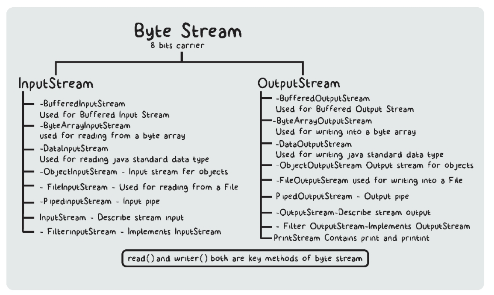

# File Handling:   
- There are instances where we need to syrpe and retrieve data from somewhere else, rather than the variables or avilable data structures. In such case, files play an impotant role
***   
* Files are names locations on a disk to styore relate dinforamtion. They are used to permanently store data in a non-volatile memory such as hard disks and more.
* These files can be any type via .txt .csv etc
* One can just flush the data in the carious files such as above according to the requirment and retrve it whenever needed.
* Files are stored in hard drives whereas, variables and other structures store data in Random Access Memory (RAM) which is volatile and loses its data when the computer is turned off or the program is terminated
* Files help us to store data permanently and retireve them since they are stored in ROM (Read-Only Mode)
#### Three steps of working with Files:
* Opening the File
* Performing Actions (Reading or Writing)
* Closing a File 
***   
#### java.io:
the Java I/O package (java.io) provides a set of input streams and a set of output streams used to read and write dat to files or other input and output sources. There are three categries of classes in java.io - input streams, output streams, and everything else
* this package contains a lot of things. Hence, to precisely work with Files, it provides a File class that can be used for all the file handling and manipulation in Java programs
* Thus, if we want to use a file class, we need to create an object of thaty particular class and should specify the filename or directory name followd by the operations.
* import java.io.*; //whole package
* import java.io.File; //file class 

### Overview of Streams in Java:
##### Streams in Java I/O:
- The stream is the only representation of input or output that us maybe a source or 
    destination of the data. It represents sequential flow (or unbroken flow) of data from one place to another place 
- In simple words, a stream is a path along which the data flows, that is, it is like a 
    pipe along which water flows. 
- It is required to accept data as input from the keyboard. The data in the form of the 
    stream may be bytes, characters, objects, etc 
- In Java I/O data flows from a source known as a data source to a destination known as a 
    data sink.
- We can write the data in the stream or read the particular data from the stream. It can 
    also be visualized as a sequence of bytes that flow out of the program. 
***   
##### Input Stream:
- A stream that recieves or reads data from a data source and sends it to a Java Program is
     called an input stream. Therefore, the input represented the flow of data into a program.
    * also one can read data fro an input stream. In principle, this can only be any 
    source of serial data but is typically a disk file, the keyboard, or a remote computer

##### Output Stream:
- Simply an output stream is a stream that takes data from a Java program and send or 
    writes data to the desitination (data sink)
    * The particular output stream can go to any device which can connect though a hard disk or maybe any stream which can contain the sequence of bytes. An output stream also can be displayed on any output screen, which has its true capability.

##### The Flow:
- The data flow from a data source to a Java program is via an input stream while the data 
    flow from a Java program to a data sink is via an output stream. 
    * the java programs reads data fro an input stream and writes data to the output stream. In both input and output streams, the Java program does not know how the details of source and destination
***   
* Depending upon the data that stream hold, Java I/O streams typically are of the 
    following types:
    * Byte Stream - In Java, the byte stream is an 8 bit carrier, that is, it allows us to transmit (perform input and output) 8 bits of data. In simple words, when an input is provided and executed with byte data, then it is called the file handling process with a byte stream.
    * Character Stream - in Java is a 16-bit Unicode carrier, The processing of input data with a character is called the file handling process with a character stream 
***   
### Classes for Input and Output:
- The streams that are byte-based are typcially implemented with classes such as InputStream or OutputStream while the streams that are character-based can be implemented with classes such as Reader or Writer
***   
#### Byte Stream Classes - InputStream

* The streams that are byte-based are typicaly implemented 
    with classes such as InputStream and OutputStream
* The java.io package contains all the classes for the 
    suppport of the streams. The class InputStream present in the java.io package is the base class for all input streams
* The InputStream class is an abstract class, which means 
    we cannot create an object of this class. We must use the subclass to create an object and do further processing.
* The several subclasses of the Java InputStream class can
     be used for performing several input functions. Tap on the above image to glace through the subclasses of the InputStream class. Following is a wuick overview of a few:
    * FileInputStream - this input stream reads bytes from 
        a file. In simple words, we can use this subclass of the InputStream class to read some data from a file in the form of bytes 
    * ByteArrayInputStream - is composed of two words, 
        bytearry and inputstream. as the name suggests it reads the byte array as an inputstream 
    * ObjectInputStream - can be used to convert 
        InputStream to object. This process of conversion of the input stream to an object is called deserialization. Simply a stream for objects instead of some data (bytes)
##### Methods of InputStream Class:
- The InputStream class prviodes several methods to perform various operations on the files:
    * int read() - the read method reads one byte of data 
        from the input stream. It returns the next input byte read as an int value in the range 0 to 255. If no byte is present because the end of the stream is reached -1 is returned
    * int read(byte[] array) - this method accepts a byte 
        array as a parameter, reads bytes from the stream, and stores them in the specified way. The mac of the array.length bytes will be read. It wil not return the data until the stream gets to the end. 
    * int read(byte[] array, int offset, int length) - it 
        works the same as the pervious method except for the length. It reads data up to the given length of bytes starting from the given offset byte.
    * void close() - closes the input stream and releases 
        any stream resources associated with it. 
### Byte Stream Classes - OutputStream:
- on the same lines as the InputStream class the 
    OutputStream class is an abstract class, which means we cannot create and object of this class. We must use the subclasses of this class to create an object and do further processing.
    - Subclasses:
    * FileOoutputStream - can be used to write data (in 
        bytes) to the files. In simple words we can use this subclass of the OutputStream class to write soe data to a file in the form of bytes.
    * ByteArrayOutputStream - is composed of two words - 
        bytearray and outputstream and can write data into byte array
    * ObjectOutputStream - class used to write objects 
        thats can be read by ObjectOutputStream 
##### Methods of OutputStram Class:
* void write(int byte) - writes the specified byte to the 
    output stream. It accepts an int value as an input param
* void write(byte[] array) - writes the bytes from the 
    specified array to the output stream 
* void write(byte[] array, int offset, int length) - same 
    as pervios method execpt for length. It writes the data up to the given length of bytes starting from the given offset byte 
* void close() - closes the output stream and releases and 
    system resources associated with it.
* void flush() - flushes the output stream and forces and 
    buffered output bytes to be written out. In simple words, it forces to write all data present in the output stream to the destination.
***   
### Working with files Pt1: 
- To read data from a data source into a Java program, we need to perform the following
    steps:
    * identify the source via file, string, array, network, connection, etc 
    * create and input stream by using the data source identified
    * read data from the input stream. Generally, we read data in a loop as long as we 
        have recieved all data from the input stream
    * close the input stream when the reading of data has finshed
- to write data to a destination(data sink) from the Java prgram we need these steps:
    * identify the destination whereyou are writing too via file, array string, network ,
        connection, etc 
    * create an output stream using the data sink that we have idenitified
    * write data to the output stream 
    * close the output stream once the writing of data is completed
