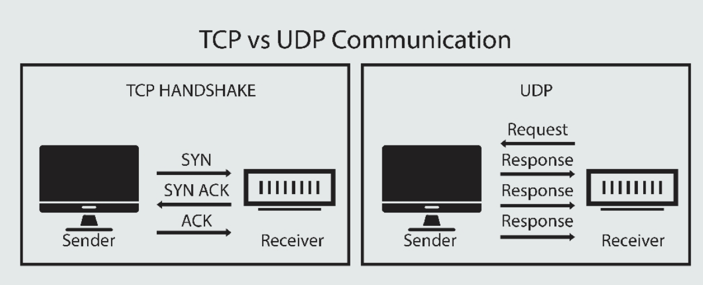

# Netwoirk Programming:
- picture an online customer support chat system. The user gets in touch with the support team to solve a problem. This is possible via the network where the user is referred to as the client and the app from where he has been communicating is the server.
- There are endless examples of using networks for active communication, interaction, and exchange of data between the client and the server. Some of the common examples are your chat featres on social media. 
- We can create such systems using Java with the help of concepts called Network or Socket Programmng. 
***   
### The Basiscs:
##### Computer Netowrks or Just a Network:
- By definition, a computer network is a group of computers that are linked together through a communication channel. The Internet is a kind of computer network.
- Therefore, a computer network comprises two or more computers that are connected, either by a wired medium such as cables or wireless connection such as Wifi with the purpose of transmitting, exchanging, or sharing data. 
- All the computer devces are called hosts or end systems. Host sending requests are called cllients while hosts recieving requests are called servers.
##### Rules:
- Computer networks all follow certain rules of communitcation when sending information back and forth. These are called network protocols which are just like traffic rules that we follow in order to achieve a safe and continuous flow of vehicles on the road. 
- Network protocols also provide the means by which computers can identify each other on a network. The sizr and purpose of the network will detimine what type pf network protocol is used.
##### IP Address:
- Computer scientists wanted to identify computers on the internet with a unique number, kind of like a phone number, enter the IP address 
- An IP(Internet Protocol) address is a unique number assigned to every device connected to anetwork that uses the Internet Protocol for communication. Each IP address identifies the device's host network and the location of the device on the network. 
##### Nodes and Routers:
* Node - is a connection point inside a networjk that cna retrieve, send, create, or 
    store data. Each node requires you to provide some form of identification to recieve an address, like an IP address.
    - a few examples of nodes are computers printers modems bridges and switches
* Router - is a physical or virtual device that send the information contained in 
    data packets between networks. It analyzes data within the packets to determine the best way for the informaiton to reach is ultimate destination
    - In simple words router forward data packets until they reach their destination 
##### Ports and Port Numbers:
- a port identifies a specific connection between netwrk devices. Each port is identifies by a number called a port number.
- If you think of an IP address as comparable to the address of a hotel, then the ports are the suites or room numbers within that hotel . Computers use port numbers to determine which app, service, or process should recieve specific messages. 
- Theerfore, a port is a virtual point where network connections should start and end.
### TCP and UDP:

* TCP - stands for Transmission Control Protocol which is communications standard 
    that enables app programs and computing devices to exchange messages over a network. It is desisned to send packets across the internet and ensure the successful delivery of data and messages over the network.
    - TCP works with the Internet Protocol(IP) which defines how computers send packets of data to each other. Hence, together they are sometimes reffered to as TCP/IP
* UDP - stands for User Diagram Protocol (UDP) is a communication protocol just like 
    TCP and is an alternative to it. In a network that uses the IP it is sometimes reffered to as UDP/IP
    - UDP is used to send short messages called datagrams but overall, it is an unreliable, connectionless protocol.
***   
- An import relationship in networks is that of the server and the client. A server 
    is a computer that holds content and services such as a website, a media file, or a chat app.  
    - a client is a different computer, such as your laptop, or use the comtent. The client can connect. The client can connect over a network to exchange information.
    - a good ex of a server is the computer that hold the data for Google's serch page. Therefore, it holds that page and sends it out when requested. 
- To Conclude, computer networks connect nodes like computers, router, and swiotches using cables, fiber optics, or wireless signals, These connections allow devices in anetwork to communicate and share information and resources.
- Networks follow protocols, ehich define whow communications are send and recieved. Each device on a network uses an Internet Protocolop or IP address, a string of numbers that uniquely ids a device and allows other devices to recognize it.
***   
### Socet Programming:
- In Java, we can create programs that can help us establish a connection with other devices over the networkand exchange information. Network programming is also known as socket programming in Java because it depends upon the sockets for connection and communication. 
- Socket programming boil down to two systems communicating with one another. In simple words, it is a means of communicating data betweem two computers across a network.
- These connections can be made using either a connection oritented protocol os a connectionless protocol. That is, the communication protocols one can use for socket programming are User Datagram protocol and Transfer Control Protocol 
* TCP is a relatively simple and reliable protocol that enables a client to make a connection to a server and the two systems to communicate whereas UDP is a connectionless protocol and is good for scenarios where you do not nessicarily need every packet to arrive at its destination.
* Therefore, the main difference between the two is that in UDP there is no session between the client and the server while in TCP an exclusive connection must be established between client and server for communication to take place.
* Think of UDP as an announcement blaring out on a loudspeaker whereas TCP is like a scheduled meeting between 2 ppl happening inside an office cabin.
#### Server Port -> connection -> Client Port
- a socket is a basic building block for socket programming in Java. It is a communication endpoint that serves as a link between two machines on a network. It has a port number, which the TCP/IP layer can use to identify the app that recieves the data
    * Therefore, an endpoint usually includes a port number and an IP address 
##### Sockets are categorized into 2 types:
* Server Socket - this socket awaits a request from a client
* Client Socket - establishes communication between client and server. To do that, it should known two things about the server. The server's IP and its port number
***   
##### java.net package:
- Java provides a collection of classes and interfaces that take care of low level communication details between the client and the server, and provide powerful infrastructure for networking. 
- Therefore in order to implement socket programming we would need to use the java.net package and import it in our project
##### SYNTAX #####
import java.net.*;
- all that being said the java.net.Socket class represents a client socket, and the java.net.ServerSocket class provides a mechanism for the server program to listen for clients and establish connections with them.
    * ServerSocket class - is used by server apps to obtain a port and listen for client requests. Basically, it is used to create a server that can connect to a client and eneable data transfer 
    - to do that the server need the object of the ServerSocket class becuase, when the connection is made, the server creates a socket object on its end of the comunication. This can be done using the following constructors:
        * ServerSocket(int portNumber)
        * ServerSocket(int portNumber, int backlog)
        - EX: ServerSocket server = new ServerSocket(5000)
        * here the app attemps t create a server socket that is bound to the specified port. Also, we can specify the backlog paramter that determines how many incoming clients to store in a wait queue
    - We can also create a server that is not bound to any port and is called an unbound server. Later, one needs to manually bind the port to the server using the bind() method. 
    - ServerSocket class methods:
        * int getLocalPort() - return that local port number to which the specified 
            socket is bound, that is the port on which the server socket is listening on.
        * Socket accept() - is used to accept the incoming requests to the socket. 
            When the ServerSocket invokes accept() the method does not return until a client connects. After a client do connect, the ServerSocket creates a new Socket on an unspecified port and returns a reference to this new Socket.
        * void bind(SocketAddress host, int backlog) - the bind method binds the ServerSocket to the specified sockey address that is IP adress and the port number. If the specified address is null the system will automatically pick up an ephemeral/temorary port and a valid local address to bind this socket.
    - Socket class - to make the connection with a server we need a socket conneciton. In simple words, itmeans a Sicket obejct that comes with java.net.Socket class. The client obtains a Socket object by instantiating one, whereas the server obtains a Socket object from the return value of the accept() method
    - To make this Socket object and initiate a connection with the srver, we need the IP address of the host and the endpoint TCP port number. Here are a few of the methods with the Socket class:
        * Socket(String host, int port)
        * Socket(InetAddress host, int port)
        - EX: Socket client = new Socket("127.0.0.1", 5000)
        * void connect(SocketAddress host, int timeout) - is used to connect the socket to the specified host. This method is only used when you instantiate the Socket using the no arguament contructor 
        * InetAddress getInetAddress() - returns the address of the other computer that this socket is connected too.
        * int getPort() - returns the remote port number to which the socket is connected. Thhis method will return the port number even after the socket is closed.
        * int getLocalPort() - return the port the socket is bound to on the local host
        * InputStream getInputStream() - returns an input stream for the given socket. This input stream is onnected to the output stream of the remote socket.
        * OutputStream getOutputStream() - returns an output stream for the given socket. This output stream is connected to the input stream of the remote socket.
        * void close() - closes the socket connection which makes the Socket object no longer capable of conneting again to any server 
### More I/O classes:
##### Packages used in Network Programming:
- java provides a collection of classes and interfaces that take care of low level communication details between the client and the server, and provide a powerful infrastructure for networking. These are mostly contained i the java.net package 
- Along with that, we also need the java.io package which gives us input and output streams to write to and read from while communicating over the network. To do that, we need to import the same using the following statement:
    * import java.io.*;
- heres a few more classes that will come in handy for networking from i/o:
    - we would be using character based streams to exchange data between the client and server while communicating. The streams that are character based are typically implemented with classes such as reader or writer
    * InputStreamReader - is usd to translate (or convert) bytes to 
        characters. It is also known as a bridge between byte streams and character streams. This is because the InputStreamReader reads bytes from the input stream as characters.
    * BufferedReader - is a Java clas to read the text from an input 
        stream by buffering characters that seamlessly read characters, arrays, or lines. The constructor of this class accepts an InputStream object as a parameter
        - also, inherits the Reader class and makes the code efficient since we can read the data line-by-line with the readline() method  
    * PrintWriter - id the implementation of the Writer class and is used to write output sata in a commonly readable form (text). It is used to print the formatted representation of object to the text-output stream.
***   
- As we know, the Socket class provides us with methods to get the Input and Output streams. Therefore, once our socket instance is connected to the server we can start obtaining input and output streams to the server.
- Intput streams are used to read data from the server while output streams are used to write data to the server. Following is how we can obtain input and output streams: 
##### SYNTAX ##### 
InputStream in = socket.getInputStream();
OutputStream out = socket.getOutputStream();
* Understand that these input and output streams are ordinary streams that we would use to read from and write to a file. Therefore, we can convert them to the form that best serves our use case.
    * We could wrap the OutputStream with a PrintWriter so that we can easily write test with methods link println()
    * Also, we could wrap the IputStream with BufferReader, via an InputStreamReader, in order to easily read text with methods link readLine()