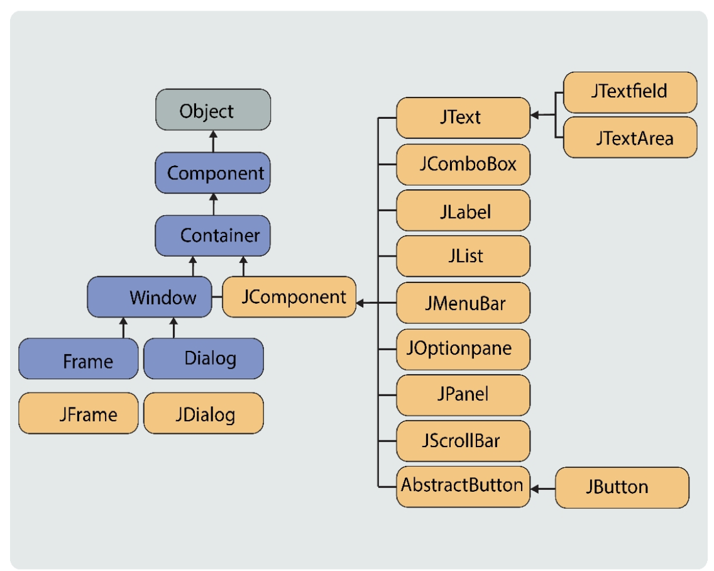

# Intro to Swing GUI:
- Java provides multiple packages and toolkits such as AWT, Swing, JavaFX, etc that enable GUI development in Java. Swing is a beginner-friendly and widely used Java technology to work with GUIs.
- the swing package is provided through the javax.swing package
```sh 
import javax.swing.*;
```
### Swing Heirarchy:     
     
